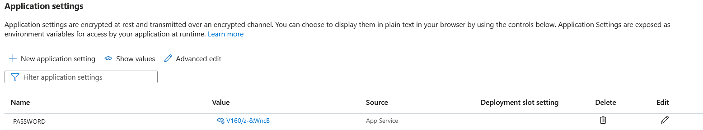

# LB 324

## Aufgabe 2

Erklären Sie hier, wie man `pre-commit` installiert.

1. Zuerst installiert man pre-commit und dann alle Dependencies, aus der "requirements.txt" Datei.

```bash
pip install pre-commit
pip install -r requirements.txt
```

2. Damit die pre-commits auch ausgeführt werden, muss man ein pre-commit.yaml Datei haben, welche wie folgt aussieht
   _man muss nur die letzten zwei hooks haben die erste hook ist optional_
   _diese Datei existiert schon ist aber gut zum wissen, was drin steht_

```yaml
repos:
  - repo: https://github.com/ambv/black
    rev: 23.7.0
    hooks:
      - id: black
        language_version: python3.11

  - repo: https://github.com/pre-commit/pre-commit-hooks
    rev: v2.0.0
    hooks:
      - id: check-byte-order-marker
      - id: check-case-conflict
      - id: check-json
      - id: check-yaml
      - id: trailing-whitespace

  - repo: local
    hooks:
      - id: needs-hash
        name: commit message needs issues
        language: pygrep
        entry: '#\d+'
        args: [--multiline, --negate]
        stages: [commit-msg]

      - id: pytest-check
        name: pytest-check
        entry: python -m pytest
        language: system
        stages: [commit, push]
        types: [python]
        pass_filenames: false
        always_run: true

      - id: auto-format
        name: Auto Format Python Code
        entry: python -m black .
        language: system
        stages: [commit]
        types: [python]
        pass_filenames: true
        always_run: true
```

3. Pre-Commit mit den Einstellungen installieren.

```bash
pre-commit install --hook-type pre-commit --hook-type pre-push
```

Nun sollten Sie pre-commit installiert haben und nun sollte es bei jedem Commit und Push erstellt werden.

## Aufgabe 4

Erklären Sie hier, wie Sie das Passwort aus Ihrer lokalen `.env` auf Azure übertragen.

In den Einstellungen unter Konfiguration gibt es Applikationen Einstellungen, dort kann man die Werte, welche man im `.env` definiert hat, hinzufügen.




[KreiselmaierDominikLB-324 Webseite](https://kreiselmaierdominiklb-324.azurewebsites.net/)
